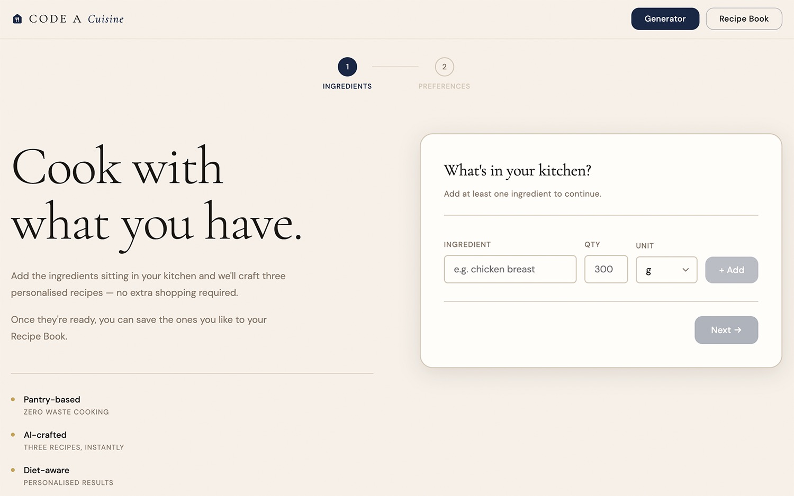

# 🍳 Code a Cuisine

Tell the app what's in your kitchen and it gives you three recipes you can cook
with what you already have — full ingredient lists and plain, step-by-step
instructions written so anyone can follow them.



## 🎞️ Live Demo

**[code-a-cuisine-three.vercel.app](https://code-a-cuisine-three.vercel.app/)**

## 🚀 Features

**Recipe generator**
- Two-step guided flow: add your ingredients (name / quantity / unit), then set
  your preferences.
- Tailor results by **portions**, **number of people**, **cooking time**
  (quick / medium / complex), **cuisine**, and **dietary needs**
  (vegan, vegetarian, keto, gluten-free, dairy-free, low-carb, paleo).
- `Any` cuisine option when you don't mind what style it is.
- Every preference is required before **Generate Recipes** unlocks, with an
  inline hint telling you what's missing.
- Returns exactly three recipes, each with a description, per-portion nutrition
  (calories / protein / carbs / fat), a full ingredient list, and 6–10
  numbered instruction steps in simple everyday language.

**Recipe Book**
- Save any generated recipe with one click; it's kept in the browser via
  `localStorage` (no account needed).
- Browse saved recipes with filters for cuisine, cooking time, and dietary tag,
  plus pagination.
- Remove a recipe by toggling **Saved** off from its card.

**Under the hood**
- Recipe generation runs through a **Vercel serverless function**
  (`api/generate.js`) so the API key never reaches the browser.
- The function retries up to 3× on rate limits, transient errors, or malformed
  model output, and surfaces a readable error in the UI if it still fails.
- The Vite dev server runs the same `/api` function locally with the same
  request/response shape Vercel uses — **works locally ⇒ works on Vercel**, no
  extra tooling.
- Responsive layout down to small mobile widths; respects
  `prefers-reduced-motion`.

## ⌨️ Tech Stack

| Area        | Choice                                              |
| ----------- | -------------------------------------------------- |
| UI          | React 19                                           |
| Build tool  | Vite 8                                             |
| Language    | JavaScript (ESM)                                   |
| Styling     | Plain CSS with design tokens (no framework)        |
| AI          | [OpenRouter](https://openrouter.ai) — model `minimax/minimax-m3:free` |
| Backend     | Vercel Serverless Functions (`/api`)               |
| Persistence | Browser `localStorage`                             |
| Linting     | ESLint 10 (flat config)                            |

## 🏗️ How It Works

```
Browser (React)
   │  POST /api/generate  { ingredients, portions, people, cookingTime, cuisines, dietPreferences }
   ▼
/api/generate.js  (Vercel function — locally: Vite dev middleware)
   │  builds a prompt, calls OpenRouter with OPENROUTER_API_KEY (server-side)
   │  parses + normalises the model's JSON, retries on failure
   ▼
{ recipes: [ { name, description, cookTime, cuisine, dietTags,
               portions, nutrition, ingredients[], instructions[] } × 3 ] }
```

The key stays server-side in both environments. Locally, a small plugin in
[`vite.config.js`](vite.config.js) mounts everything in `/api` as real
endpoints during `npm run dev`, mirroring Vercel's runtime.

## 📁 Project Structure

```
api/
  generate.js          Serverless function: prompt building, OpenRouter call, retries
src/
  api.js               Front-end wrapper around POST /api/generate
  cookbook.js           localStorage-backed Recipe Book store
  App.jsx               App shell, routing between screens, generate flow
  App.css               All styles + design tokens
  components/
    StepIngredients.jsx  Step 1 — add ingredients
    StepPreferences.jsx  Step 2 — preferences + validation
    LoadingScreen.jsx    Generation loading state
    ResultsPage.jsx      The three generated recipes
    RecipeCard.jsx       Recipe card (used in results and the Recipe Book)
    CookbookPage.jsx     Recipe Book — filters + pagination
    LogoIcon.jsx
  pages/
    PrivacyPage.jsx
    TermsPage.jsx
vite.config.js          Vite config + local /api dev middleware
```

## 🔑 Environment

Create a `.env` file in the project root (copy [`.env.example`](.env.example)):

```bash
OPENROUTER_API_KEY=sk-or-...
```

Get a free key at <https://openrouter.ai/keys>. It's used **only** by
`api/generate.js` on the server — it is never bundled into the client.

## 🚦 Getting Started

**Prerequisites:** Node.js 18+ (developed on Node 24).

```bash
npm install
cp .env.example .env      # then paste your OpenRouter key
npm run dev
```

Open <http://localhost:5173/>. Editing any source file hot-reloads the app.
Because the dev server also runs `/api`, recipe generation works the same
locally as in production.

## 📜 Available Scripts

| Command           | What it does                                            |
| ----------------- | ------------------------------------------------------ |
| `npm run dev`     | Start the dev server (with the local `/api` function)  |
| `npm run build`   | Production build into `dist/`                          |
| `npm run preview` | Serve the built `dist/` (static only — no `/api`)      |
| `npm run lint`    | Run ESLint over the project                            |

## ☁️ Deploying to Vercel

1. Import the repository into Vercel (framework preset: **Vite**).
2. Add an environment variable **`OPENROUTER_API_KEY`** under
   *Project → Settings → Environment Variables*.
3. Deploy. Vercel automatically serves `/api/generate.js` as a serverless
   function — no config file needed.

## 📝 Notes & Limitations

- **Free model:** `minimax/minimax-m3:free` is rate-limited on OpenRouter's free
  tier and occasionally returns imperfect JSON — the function retries, but under
  heavy use a request can still fail. Swap `MODEL` in
  [`api/generate.js`](api/generate.js) for a paid model if you need reliability.
- **Recipe Book is per-browser:** saved recipes live in `localStorage` on one
  device. Clearing site data or switching browsers loses them. Making it
  cross-device would require a real backend/database.
- **`npm run preview`** serves only the static build, so recipe generation won't
  work there — use `npm run dev` or a Vercel deployment.

## 📚 Additional Resources

- [Vite documentation](https://vite.dev/)
- [OpenRouter documentation](https://openrouter.ai/docs)
- [Vercel Functions documentation](https://vercel.com/docs/functions)
